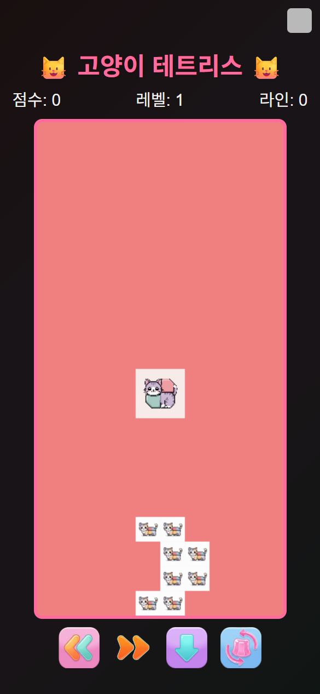

# 🐱 고양이 테트리스 (Cat Tetris)

귀여운 고양이 블록으로 즐기는 클래식 테트리스 웹 게임입니다.



## ✨ 주요 기능

- **클래식 테트리스 게임 플레이**: 전통적인 테트리스 규칙을 따릅니다.
- **귀여운 고양이 테마**: 테트리스 블록이 귀여운 고양이 이미지로 구성되어 있습니다.
- **점수 및 레벨 시스템**: 라인을 클리어하여 점수를 획득하고, 레벨을 올릴 수 있습니다.
- **사운드 효과**: 블록 이동, 회전, 라인 클리어 등 다양한 게임 액션에 맞는 사운드가 포함되어 있습니다.
- **모바일 지원**: 터치스크린 기기를 위한 화면 내 컨트롤 버튼을 제공합니다.
- **PWA 지원**: 기기에 앱처럼 설치하여 오프라인으로 플레이할 수 있습니다.

## 🛠️ 사용 기술

- **HTML5**
- **CSS3**
- **JavaScript (ES6+)**

## 🎮 플레이 방법

- **키보드**
  - **← / →**: 블록 좌우 이동
  - **↑**: 블록 회전
  - **↓**: 블록 아래로 이동
  - **Space**: 블록 즉시 내리기 (Hard Drop)
- **모바일**
  - 화면에 표시된 컨트롤 버튼을 터치하여 조작합니다.

## 🚀 PWA (Progressive Web App) 설치

이 게임은 PWA를 지원하므로 기기에 설치하여 네이티브 앱처럼 사용할 수 있습니다.

1.  Chrome, Edge, Safari 등 PWA를 지원하는 브라우저에서 게임에 접속합니다.
2.  주소창에 나타나는 **설치 아이콘**을 클릭하거나, 브라우저 메뉴에서 **"홈 화면에 추가"** 또는 **"앱 설치"**를 선택합니다.
3.  설치 후 홈 화면이나 바탕화면에 생성된 아이콘을 통해 게임을 바로 실행할 수 있습니다.

### ⚠️ 설치 활성화 방법

현재 PWA 기능이 활성화되어 있지 않습니다. `manifest.json` 파일을 브라우저가 인식하도록 하려면, `index.html` 파일의 `<head>` 섹션 안에 아래 코드를 추가해야 합니다.

```html
<link rel="manifest" href="manifest.json">
```
