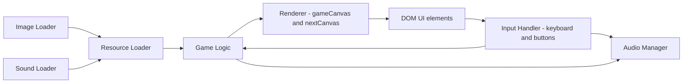
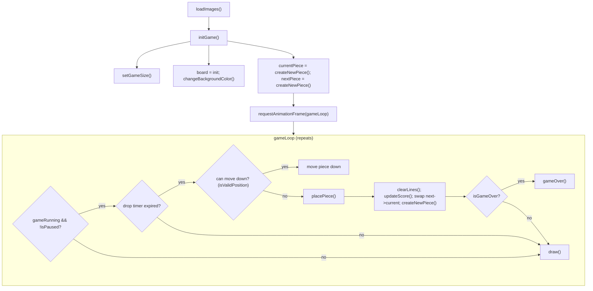
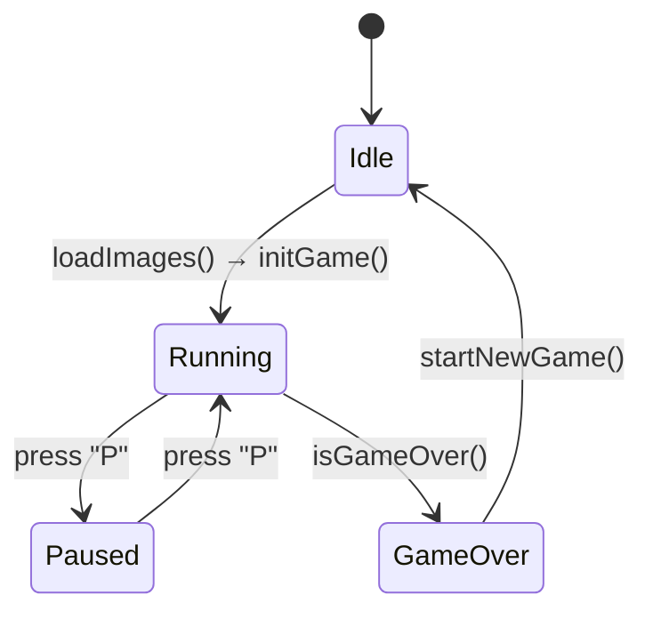
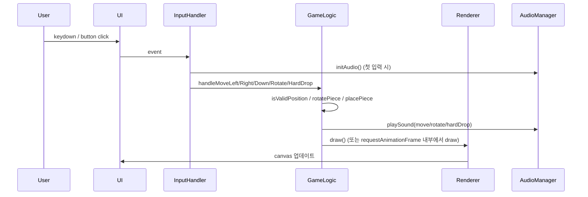
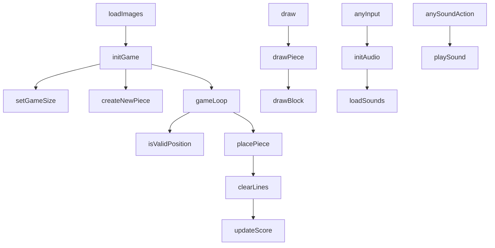

# 🐱 고양이 테트리스 (Cat Tetris)

귀여운 고양이 블록으로 즐기는 클래식 테트리스 웹 게임입니다.


## ✨ 주요 기능

- **클래식 테트리스 게임 플레이**: 전통적인 테트리스 규칙을 따릅니다.
- **귀여운 고양이 테마**: 테트리스 블록이 귀여운 고양이 이미지로 구성되어 있습니다.
- **점수 및 레벨 시스템**: 라인을 클리어하여 점수를 획득하고, 레벨을 올릴 수 있습니다.
- **사운드 효과**: 블록 이동, 회전, 라인 클리어 등 다양한 게임 액션에 맞는 사운드가 포함되어 있습니다.
- **모바일 지원**: 터치스크린 기기를 위한 화면 내 컨트롤 버튼을 제공합니다.
- **PWA 지원**: 기기에 앱처럼 설치하여 오프라인으로 플레이할 수 있습니다.

## 🛠️ 사용 기술

- **HTML5**
- **CSS3**
- **JavaScript (ES6+)**

## 🎮 플레이 방법

- **화면하단 버튼**  
  - 화면에 표시된 컨트롤 버튼을 터치하여 조작합니다.

## 🚀 PWA (Progressive Web App) 설치

이 게임은 PWA를 지원하므로 기기에 설치하여 네이티브 앱처럼 사용할 수 있습니다.

1.  Chrome, Edge, Safari 등 PWA를 지원하는 브라우저에서 게임에 접속합니다.
2.  **주소창**에 나타나는 **설치 아이콘**을 클릭하거나, 
    브라우저 메뉴에서 **"홈 화면에 추가"** 또는 **"앱 설치"**를 선택합니다.
3.  설치 후 홈 화면이나 바탕화면에 생성된 아이콘을 통해 게임을 바로 실행할 수 있습니다.


```bash
### 1. 초기 설정 및 변수 선언
파일의 가장 윗부분에서는 게임에 필요한 기본 변수들을 설정합니다.

Canvas와 Context: document.getElementById()를 사용해 index.html에 있는 
gameCanvas(메인 게임판)와 nextCanvas(다음 블록 표시)를 가져오고, 
getContext('2d')를 통해 그림을 그릴 수 있는 도구를 얻습니다.

게임 보드 크기: BOARD_WIDTH (10칸), BOARD_HEIGHT (20칸)와 같이 게임판의 크기를 상수로 정의합니다.

게임 상태 변수: board(게임판의 현재 상태를 저장하는 2차원 배열), 
                currentPiece(현재 움직이는 블록), 
                nextPiece(다음에 나올 블록), 
                score(점수), 
                level(레벨), 
                lines(지운 줄 수) 등 게임의 모든 상태를 추적하는 변수들을 선언합니다.

반응형 크기 조절: setGameSize() 함수는 브라우저 창의 크기에 맞춰 
                  블록의 크기(BLOCK_SIZE)와 캔버스의 크기를 동적으로 계산합니다. 
                  이를 통해 다양한 화면 크기에서도 게임판이 깨지지 않고 잘 보이도록 합니다.

### 2. 게임 리소스(Assets) 정의 및 로딩
게임에 사용될 이미지와 사운드를 설정하고 불러옵니다.

catImages: 각 테트리스 블록(I, O, T, S, Z, J, L)에 해당하는 고양이 이미지 파일의 경로를 저장하는 객체입니다.

soundEffects: 블록 이동, 회전, 줄 제거 등 다양한 게임 상황에 맞는 사운드 파일의 경로를 저장합니다. 
              사운드 파일 로딩에 실패할 경우를 대비해 fallback으로 간단한 '삑' 소리(beep)를 내도록 설정되어 있습니다.

loadImages(): 게임 시작 전에 모든 고양이 이미지를 미리 불러오는 함수입니다. 
              이미지가 모두 로딩되어야 initGame() 함수를 호출하여 게임을 시작합니다.

loadSounds(): 사운드 파일을 불러옵니다. 
              브라우저 정책상 사용자의 상호작용(클릭, 키보드 입력 등)이 있을 때만 
              오디오를 재생할 수 있으므로, 첫 입력이 있을 때 
              사운드를 초기화(initAudio)합니다.

### 3. 게임의 핵심 로직
pieces 객체: 모든 테트리스 블록의 형태와 회전 상태를 2차원 배열로 
             정의한 거대한 데이터 덩어리입니다. 게임의 모든 블록 모양은 여기서 비롯됩니다.

gameLoop(timestamp) (게임 루프): 이 게임의 심장입니다. 
                                 requestAnimationFrame을 통해 1초에 약 60번씩 계속해서 호출되며, 
                                 게임의 상태를 업데이트하고 화면을 새로 그립니다.

블록 하강: dropInterval(레벨에 따라 점점 짧아짐)마다 currentPiece의 y좌표를 1씩 증가시켜 블록을 아래로 내립니다.

충돌 감지: 블록이 바닥이나 다른 블록에 닿으면(isValidPosition 함수가 false를 반환), 
            placePiece() 함수를 호출하여 블록을 현재 위치에 고정시킵니다.

줄 검사 및 제거: 블록이 고정된 후 clearLines() 함수가 꽉 찬 가로줄이 있는지 검사합니다. 
                 꽉 찬 줄이 있다면 해당 줄을 지우고, 점수와 레벨을 올리고, 
                 lineClear 또는 tetrisClear 사운드를 재생합니다.

새 블록 생성: 현재 블록을 고정시킨 후, nextPiece를 currentPiece로 가져오고, 
              createNewPiece() 함수로 다음 nextPiece를 무작위로 생성합니다.

게임 오버: 새 블록을 생성할 위치가 이미 다른 블록으로 막혀있으면(isGameOver가 true), 
           게임을 멈추고 게임 오버 화면을 표시합니다.

### 4. 렌더링 (화면에 그리기)
draw() 함수: 게임 루프가 돌 때마다 호출되며, 
             캔버스를 깨끗이 지운 뒤 board 배열에 저장된 모든 블록과 현재 움직이는 currentPiece를 화면에 다시 그립니다.

drawPiece() 함수: 이 게임의 가장 독특한 시각적 기능입니다.
                  context.clip()을 사용해 현재 블록의 모양대로 보이지 않는 '클리핑 영역(마스크)'을 만듭니다.
                  해당 블록의 고양이 이미지를 클리핑 영역 전체에 꽉 차게 그립니다.
                  결과적으로, 여러 개의 사각형이 아닌 하나의 큰 고양이가 테트리스 블록 모양으로 잘려진 것처럼 보이게 됩니다.

drawNextPiece(): nextCanvas에 다음에 나올 블록을 그려줍니다.

### 5. 사용자 입력 처리 (이벤트 리스너)
키보드 입력: document.addEventListener('keydown', ...)을 통해 키보드 입력을 감지합니다.

방향키: 블록을 좌, 우, 아래로 움직입니다.

위쪽 방향키: 블록을 회전(handleRotate)시킵니다.

스페이스바: 블록을 맨 아래로 즉시 내리는 '하드 드롭' 기능입니다.

'p' 키: 게임을 일시정지/재개합니다.

화면 버튼 입력: index.html에 있는 화면의 버튼(btn-left, btn-right 등)에 
                click 이벤트 리스너를 추가하여, 모바일 기기에서도 터치로 조작할 수 있게 합니다. 
                이 버튼들은 키보드 입력과 동일한 함수(handleMoveLeft 등)를 호출합니다.


### 요약
main.js는 ① 게임 초기화 
          → ② 사용자 입력 감지 
          → ③ 게임 상태 업데이트(블록 이동, 충돌 감지, 줄 제거) 
          → ④ 화면에 다시 그리기 의 과정을 gameLoop를 통해 
          무한히 반복하면서 게임을 진행시키는 핵심 엔진 파일입니다. 
          
          특히 고양이 이미지를 블록 모양에 맞춰 
          그려내는 독창적인 렌더링 방식이 이 게임의 가장 큰 기술적 특징이라고 할 수 있습니다.
```


## Mermaid vsCode Extension 설치
> "Markdown Mermaid Viewer" 확장 프로그램 

## Component diagram



## 초기화 + 메인 흐름도 (gameLoop 중심)



## 상태도 (게임 상태 전이)


## 입력 → 처리 시퀀스 (예: 좌/우/회전/하드드롭)


## 주요 함수 맵 (간단한 참조)
