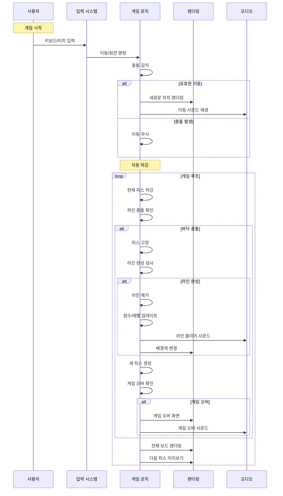
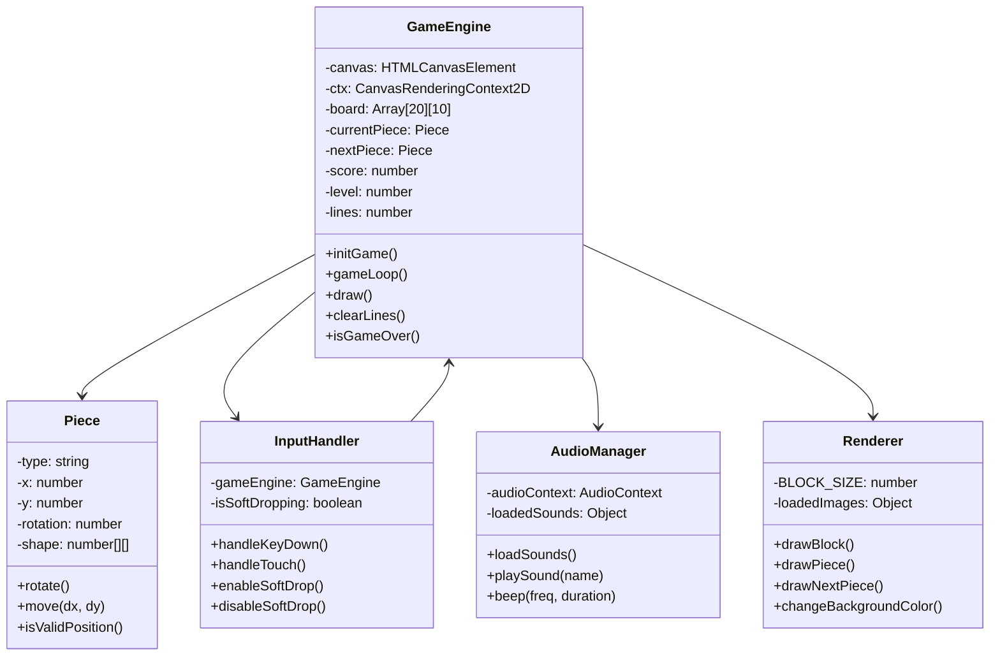
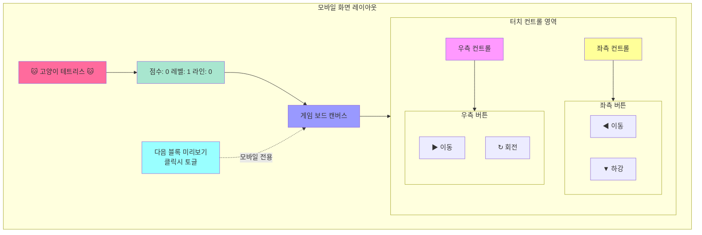
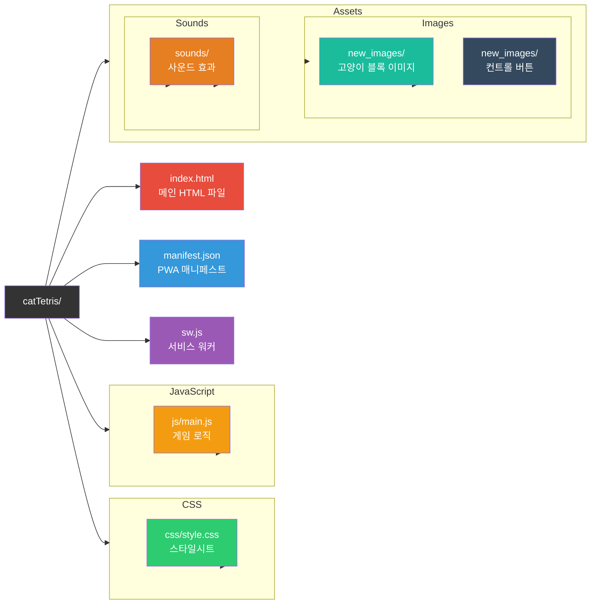

# UML Diagrams for catTetris Game

> 이 다이어그램들은 CatTetris 게임
> 전체 아키텍처, 데이터 흐름, 클래스 구조, 모바일 레이아웃, 파일 구조를 
> 시각적으로 보여줍니다. 
> 
> 각 다이어그램은 특정 관점에서 게임의 구조를 설명하며, 
> Mermaid 문법으로 작성되어 VS Code에서 바로 미리보기가 가능합니다.
>> 

## Mermaid vsCode Extension 설치
> "Markdown Mermaid Viewer" 확장 프로그램> 
> 
> ---

### CatTetris 게임 아키텍처 다이어그램

```mermaid

%%{init: {'theme': 'default', 
          'themeVariables': { 'primaryColor': '#ff6b9d', 
                              'primaryTextColor': '#fff', 
                              'primaryBorderColor': '#e55a87', 
                              'lineColor': '#ff9a9e', 
                              'tertiaryColor': '#fecfef'
                            }
        }
  }%%

flowchart TB
    subgraph Frontend["클라이언트 측 (Frontend)"]
        A[HTML Structure<br>index.html]
        B[CSS Styling<br>style.css]
        C[JavaScript Logic<br>main.js]
        
        subgraph UIComponents["UI 컴포넌트"]
            D[게임 캔버스<br>#gameCanvas]
            E[다음 블록 캔버스<br>#nextCanvas]
            F[점수/레벨 표시]
            G[터치 컨트롤 버튼]
            H[게임 오버 화면]
        end
        
        subgraph MediaAssets["미디어 에셋"]
            I[고양이 블록 이미지<br>new_I.png, new_O.png 등]
            J[컨트롤 버튼 이미지<br>left.png, right.png 등]
            K[사운드 효과<br>move.wav, rotate.wav 등]
        end
    end
    
    subgraph Backend["서비스 워커 & PWA"]
        L[Service Worker<br>sw.js]
        M[Web App Manifest<br>manifest.json]
    end
    
    subgraph GameCore["게임 코어 엔진"]
        subgraph GameState["게임 상태 관리"]
            N[보드 데이터<br>10x20 배열]
            O[현재 피스<br>위치/회전 상태]
            P[다음 피스<br>미리보기]
        end
        
        subgraph GameLogic["게임 로직"]
            Q[피스 이동/회전<br>충돌 감지]
            R[라인 클리어<br>점수 계산]
            S[레벨 업<br>속도 증가]
            T[게임 오버<br>조건 확인]
        end
        
        subgraph Rendering["렌더링 시스템"]
            U[메인 보드 그리기]
            V[다음 블록 미리보기]
            W[고양이 이미지<br>렌더링]
            X[배경색<br>랜덤 변경]
        end
    end
    
    subgraph InputSystem["입력 처리 시스템"]
        Y[키보드 입력<br>화살표 키, 스페이스]
        Z[터치 입력<br>모바일 버튼]
        AA[소프트 드롭<br>가속 하강]
    end
    
    subgraph AudioSystem["오디오 시스템"]
        BB[Web Audio API<br>초기화]
        CC[사운드 효과<br>재생]
        DD[폴백 비프음<br>생성]
    end
    
    %% 연결 관계
    A --> D
    A --> E
    A --> F
    A --> G
    A --> H
    
    B --> UIComponents
    C --> GameLogic
    C --> Rendering
    C --> InputSystem
    C --> AudioSystem
    
    I --> W
    J --> G
    K --> CC
    
    L --> M
    
    N --> Q
    O --> Q
    P --> V
    
    Q --> R
    R --> S
    Q --> T
    
    Y --> Q
    Z --> Q
    AA --> Q
    
    BB --> CC
    CC --> DD
    
    %% 스타일링
    classDef frontend fill:#ff9999
    classDef backend fill:#99ff99
    classDef game fill:#9999ff
    classDef input fill:#ffff99
    classDef audio fill:#ff99ff
    
    class A,B,C,D,E,F,G,H,I,J,K frontend
    class L,M backend
    class N,O,P,Q,R,S,T,U,V,W,X game
    class Y,Z,AA input
    class BB,CC,DD audio
```

> 게임 데이터 흐름 다이어그램

> 클래스 구조 다이어그램

> 모바일 레이아웃 다이어그램

> 파일 구조 다이어그램

